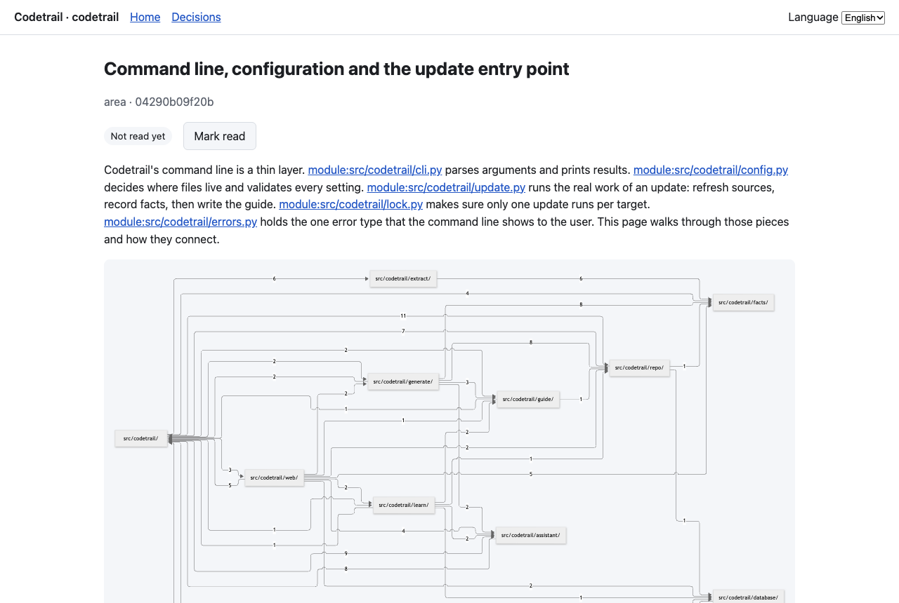
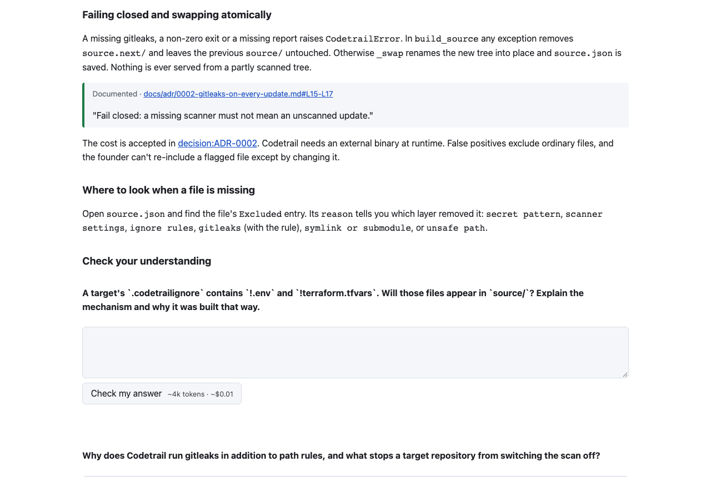
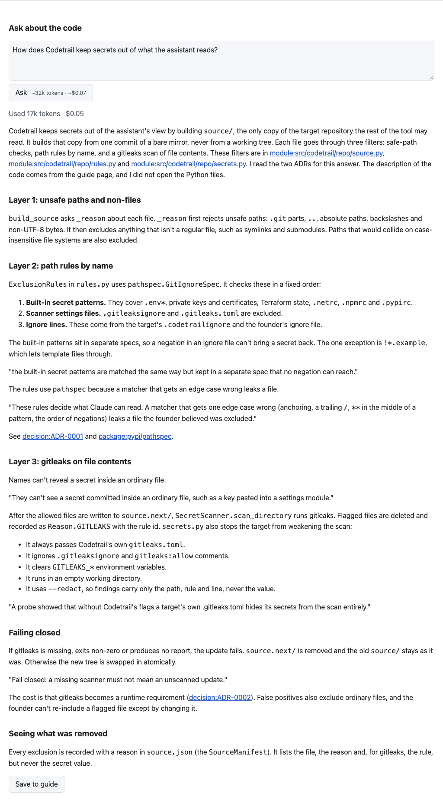
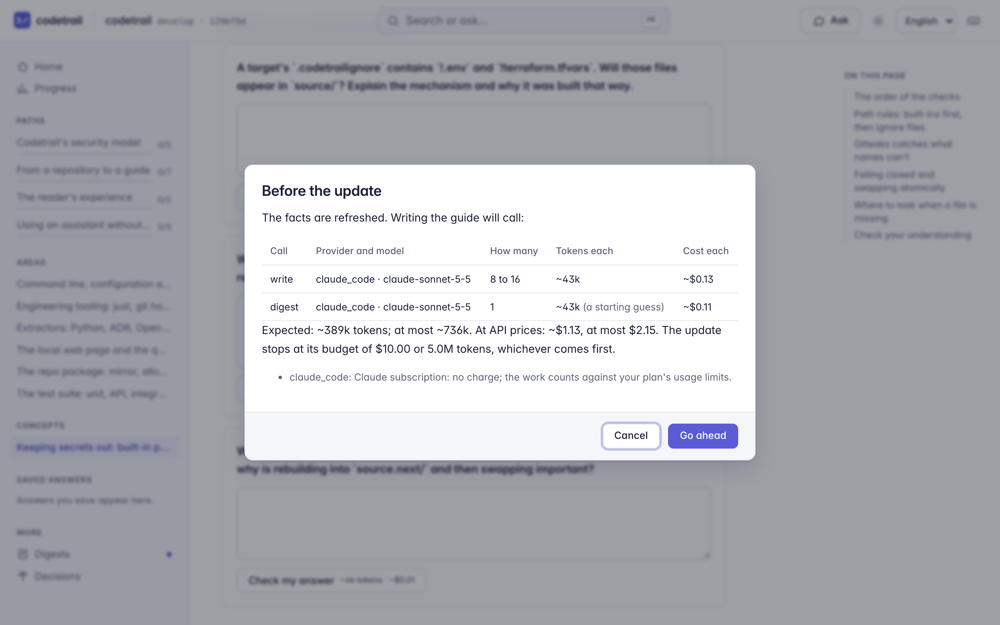
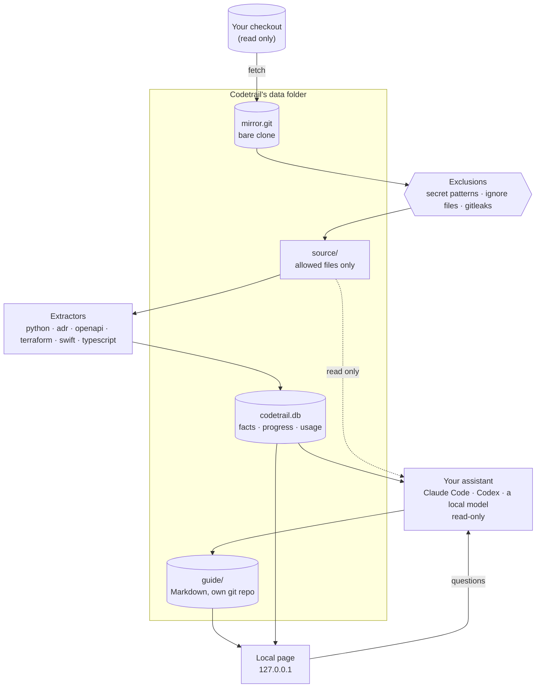
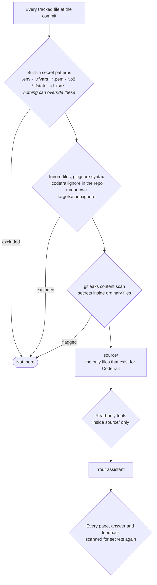
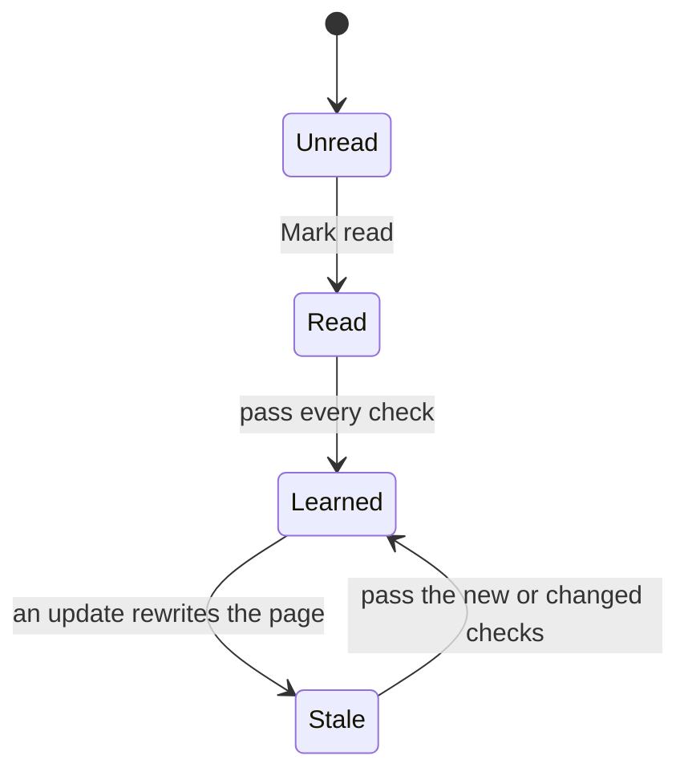
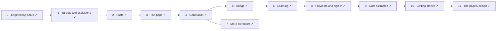

<h1>
  <picture>
    <source media="(prefers-color-scheme: dark)" srcset="docs/images/logo-dark.svg">
    
  </picture>
</h1>

**Turn a git repository into a local learning guide that keeps up with it.**

Codetrail is for the person responsible for a repository that changes faster than they can follow. It tells you what changed and why it matters, and teaches the architecture, design patterns and tools behind the code: concept pages tied to the real code, guided paths through it, checks on your understanding, and progress that notices when what you learned has gone stale. You read it as a local web page, and you can ask your assistant questions from any page.

It works with the assistant you already pay for: **Claude Code** on a Claude subscription (the default), **Codex** on a ChatGPT subscription, or **a free local model** through Ollama or LM Studio. Before anything is spent, Codetrail shows an estimate and asks.

**[Get started in ten minutes →](docs/getting-started.md)**


## Contents
- [Why Codetrail](#why-codetrail)
- [What you get](#what-you-get)
- [A tour](#a-tour)
- [How it works](#how-it-works)
- [Your assistant, your subscription](#your-assistant-your-subscription)
- [No surprise costs](#no-surprise-costs)
- [Grounded, not guessed](#grounded-not-guessed)
- [Secrets stay out](#secrets-stay-out)
- [Learning, and knowing when it went stale](#learning-and-knowing-when-it-went-stale)
- [Languages](#languages)
- [Status](#status)
- [Developing Codetrail](#developing-codetrail)
- [Documentation](#documentation)
- [Credits](#credits)

## Why Codetrail

An assistant such as Claude Code already answers questions about a repository well. What it doesn't give you:

| An assistant alone | Codetrail |
|---|---|
| Each session rediscovers the architecture | A curated guide that persists and grows with the repository |
| Answers what you ask; you have to know what to ask | Tells you what changed since you last looked, and teaches it |
| Diagrams drawn from memory can invent connections | Diagrams drawn only from facts extracted from the code |
| A guess and a decision read the same | Rationale is marked **documented** (quoted and checked) or **inferred** |

Codetrail uses the assistant for meaning and code for structure: deterministic extractors parse the repository into facts, and the assistant writes explanations from those facts, reading files read-only for the "why".

## What you get

| | Feature | What it does |
|---|---|---|
| 🔔 | **"You're behind" signal** | How many merges landed since the guide was last updated, and which areas they touched. Computed from git alone, so it costs nothing. |
| 📰 | **Digests** | One per update: what changed, why it matters, which pages changed. |
| 🗺️ | **Area and concept pages** | Each component and each pattern, tool or decision, explained against the real code. |
| 📈 | **Grounded diagrams** | Imports, dependencies and infrastructure drawn from extracted facts; every node links to its source. |
| 📜 | **Documented versus inferred** | Rationale quoted from an ADR or commit is verified against the source; everything else is labelled as the assistant's reading. |
| 💬 | **Ask from any page** | Questions go to your assistant with read-only tools; answers come into the page in your language. |
| 📌 | **Save to guide** | Answers worth keeping become part of the guide instead of disappearing like chat history: they're in the sidebar, on the Saved answers page, and in search. |
| 🔎 | **Search** | Press ⌘K or / on any page to search the guide's pages, saved answers, decisions and facts. It runs on your machine and costs nothing. |
| ⌨️ | **Shortcuts** | Ask (A), go places (G then H, P, S, D or R), step through a path ([ and ]), mark read (M), update (U). None of them spends anything. |
| 🧭 | **Guided paths** | Ordered routes through the pages toward a goal, such as "how a request travels through the API". The home page picks up where you left off. |
| ✅ | **Checks** | Open questions on each page, graded against a rubric grounded in the code. |
| ♻️ | **Staleness** | When the code behind a page you learned changes, the page says so and shows what changed. |
| 💲 | **Estimates first** | Every paid action shows what it will use before it runs: tokens, dollars at API prices, and your plan's usage. |

## A tour

These screenshots are Codetrail's guide to its own repository, written by Claude Code on a subscription.

**A concept page** explains one part of the code, with quotes checked against their source lines, links to every fact and file, and an outline that follows you down the page. **Previous** and **Next** follow the path you came from.



**Search** the whole guide from the keyboard: press ⌘K or /, type, and press Enter.


**Checks** test your understanding. Each button shows what the call will use, and the answer shows what it did use.



**Ask** from any page (press A): the panel opens beside the page you're reading and keeps this session's answers as you move around. **Send** shows the estimate first, and **Save to guide** keeps an answer for good.



**Update the guide** refreshes the facts for free, then shows the estimate. Nothing is spent until you choose **Go ahead**.



## How it works

Codetrail never writes to the repository it teaches. It keeps its own mirror, copies out only the files it is allowed to see, extracts facts from them, and has your assistant write the guide from the facts.



**An update, step by step.** You run it on demand, from the command line or the page's Update button.

```mermaid
sequenceDiagram
    autonumber
    participant You
    participant Repo as repo
    participant Extract as Extractors
    participant Facts as Fact store
    participant Gen as Generator
    participant Assistant
    participant Guide as Guide (git)

    You->>Repo: codetrail update shop
    Repo->>Repo: fetch the branch, rebuild source/ without excluded files
    Repo->>Extract: allowed files
    Extract->>Facts: entities and relations (free)
    Facts->>Gen: facts added, changed, removed
    Gen-->>You: the estimate: calls, tokens, dollars, plan usage
    You->>Gen: go ahead
    loop each affected page, within the budget
        Gen->>Assistant: page outline + facts + log (read-only tools)
        Assistant-->>Gen: draft and checks
        Gen->>Gen: verify quotes, fact links, diagrams; scan for secrets
    end
    Gen->>Guide: pages + digest, one commit
    Guide-->>You: "7 pages written, used ~776k tokens"
```

If an update is interrupted, the guide's uncommitted changes are discarded and nothing is half-written. Pages that failed or didn't fit in the budget are picked up by the next update.

## Your assistant, your subscription

| Provider | Runs | Signs in with | Reads |
|---|---|---|---|
| `claude_code` (default) | Your own `claude -p` | Your Claude Pro or Max subscription | Only the allowed files: Claude Code's own permission rules and Codetrail's guard, each enough on its own |
| `codex` | Your own `codex exec`, in its read-only sandbox | Your ChatGPT Plus or Pro subscription | Anything you can read; so a repository must opt in to it |
| `local` | Codetrail's own tool loop against Ollama or LM Studio on `127.0.0.1` | Nothing: it's free | Only the allowed files, through Codetrail's own tools |

Codetrail runs the programs you have already signed in to and **never reads, stores or passes your password, token or API key**. It removes every API key from those programs' environment, so the work counts against your subscription and never bills an API account by surprise. An API key is used only if you set `auth = "api_key"` for that provider. Each kind of call (plan, write, digest, answer, grade) can use a different provider and model, for example Claude Code for pages and a local model for quick questions.

`codetrail providers` shows what's installed and signed in, and how.

## No surprise costs

```
This update will call:
  plan    claude_code · claude-opus-5-5: 1 call(s), ~68k tokens each (a starting guess), ~$0.40 each
  write   claude_code · claude-sonnet-5-5: 8 to 16 call(s), ~126k tokens each (a starting guess), ~$0.30 each
  digest  claude_code · claude-sonnet-5-5: 1 call(s), ~43k tokens each (a starting guess), ~$0.11 each
Expected: ~1.1M tokens (at most ~2.1M), ~$2.91 (at most $5.31) at API prices. The update stops at its budget of $10.00 or 5.0M tokens.
claude_code: Claude subscription (max), so no charge; the work counts against your plan's usage limits.
Continue? [y/N]
```

- **An update** refreshes the facts first, which costs nothing, then estimates and asks, in the terminal or in a dialog on the page. In a script it spends nothing unless you pass `--yes`.
- **A question or a check** shows its estimate on its button, and what it used afterwards.
- **Estimates** start from sensible guesses, then use the median of your own recent calls. Dollars are API list prices, kept in configuration because they change. On a subscription you pay nothing extra, and the estimate shows how much of your plan's usage windows you've used.
- **Hard limits** stop any update at its dollar or token budget, and every question and check at its own budget.

## Grounded, not guessed

**Diagrams come from facts.** An extractor turns `services/api/app/orders.py` importing `app.db` into the relation `module:app.orders` → `imports` → `module:app.db`, with the source line. A diagram is a query over those facts, so it can't show a connection the code doesn't have. Above a size limit, it rolls up to directories, so it stays readable.

**Rationale says where it comes from.** The assistant writes rationale in two kinds of block. Codetrail checks that a documented quote really appears in the cited lines at that commit before the page is saved:

```markdown
> [!documented] docs/adr/0007-rest-api-with-openapi-contract.md#L12-L18
> "Use REST with the OpenAPI document as the contract …"

> [!inferred]
> The handlers stay thin and delegate to services, which suggests …
```

## Secrets stay out

Codetrail runs an assistant over repositories that hold secrets, so what it can see is decided before anything reads a file.



An excluded file is as if it weren't in the repository: it isn't extracted, readable by the assistant, shown in the page, or included in diffs, digests or the "you're behind" counts. Symlinks are never copied. `codetrail files <target>` shows exactly what's visible and what's hidden, and why.

**The local page is locked down too.** It listens on `127.0.0.1` only, checks `Host` and `Origin`, signs you in with a one-time code that becomes a strict session cookie, requires a per-session token on every write, renders Markdown with raw HTML disabled, sends a strict Content Security Policy, and tells the browser never to store its pages.

## Learning, and knowing when it went stale



When a page you learned is rewritten, it shows a diff of what changed since you learned it, and only the new or changed checks need answering again. "Since you last caught up" lists the digests you haven't read, then the pages that went stale.

## Languages

The interface is English first and switches language from the page. Each language is one gettext catalog (`src/codetrail/locales/<code>/LC_MESSAGES/codetrail.po`); adding a language means adding a catalog, with no code change. Right-to-left languages are supported. The guide's pages stay in English, because the sources and the quotes are in English; live answers and check feedback come back in the language you choose.

## Status

Every phase in the [design](docs/design/2026-10-05-codetrail-design.md) is built and tested.



| Phase | What you can do | Status |
|---|---|---|
| 0. Engineering setup | `just ci` passes; the agent rules are enforced by hooks and permissions | Done |
| 1. Targets and exclusions | See exactly which committed files Codetrail can read, with secrets and your excluded files gone; remove a target and everything Codetrail kept for it | Done |
| 2. Facts | Modules, packages and decisions as facts | Done |
| 3. The page | A grounded map of the repository that says when it's behind, at no cost | Done |
| 4. Generation | The guide: digests, area and concept pages | Done |
| 5. Bridge | Ask from any page and save the answers | Done |
| 6. Learning | Paths, checks, progress and staleness | Done |
| 7. More extractors | OpenAPI, Terraform and Swift packages in the guide | Done |
| 8. Providers and sign-in | Claude Code, Codex or a local model, on your own subscription | Done |
| 9. Cost estimates | An estimate before every paid action | Done |
| 10. Getting started | This README, and the [getting-started guide](docs/getting-started.md) | Done |
| 11. The page's design | A new look with progress first, search, a command palette, shortcuts, an Ask panel, and pages for progress, saved answers and digests; tested in a real browser | Done |

Codex and local models are tested against stand-ins and Codetrail's own tests; Claude Code is also tested live. Codex's provider decision is [ADR 0006](docs/adr/0006-assistant-providers-and-subscriptions.md).

## Developing Codetrail

Python with uv, FastAPI, SQLite, tree-sitter and httpx. mise pins the tools, `just` runs everything, lefthook runs the git hooks, commits follow Conventional Commits with a *Why* in every body, and branches follow git-flow with local-only finishes.

- **Test first.** Every behaviour starts as a failing test, including what must be refused: excluded files, rejected requests, tools an assistant may not use.
- **Coding agents never push**, never touch credentials and never write to a target repository. The full rules are in [AGENTS.md](AGENTS.md).

Once per clone:

```bash
mise trust && mise install
```

```bash
just setup
```

`mise install` puts gitleaks behind a mise shim pinned to this repository, so a Codetrail started from another folder finds no version there and says so: set one globally with `mise use -g gitleaks`, or set `[tools] gitleaks` in `~/.config/codetrail/config.toml` to the path `mise which gitleaks` prints.

Then `just ci` runs every check CI runs; `just lint`, `just format`, `just typecheck`, `just test`, `just test-quick` (run by the pre-push hook), `just test-browser` (the page in headless Chromium, which `just setup` installs) and `just test-live` (the real providers installed here, local only) run one kind each. Each phase's implementation plan is in [docs/design/plans/](docs/design/plans/).

## Documentation

| Document | What's in it |
|---|---|
| [Getting started](docs/getting-started.md) | Install, connect an assistant, add a repository, build and read the guide |
| [Design](docs/design/2026-10-05-codetrail-design.md) | The whole system: architecture, exclusions, facts, generation, page and bridge, learning, providers and estimates, errors, testing, phases |
| [Brainstorm decisions](docs/design/brainstorm-decisions.md) | The problem, every early decision and why |
| [Architecture decision records](docs/adr/README.md) | Decisions that are hard to reverse |
| [Security review checklist](docs/security/review-checklist.md) | What every change is reviewed against |
| [AGENTS.md](AGENTS.md) | Rules and workflow for coding agents |

## Credits

- The page's typeface is [Inter](https://rsms.me/inter/) by Rasmus Andersson, under the SIL Open Font License 1.1 ([its licence](src/codetrail/web/static/vendor/inter/LICENSE.txt), [ADR 0007](docs/adr/0007-bundle-the-inter-typeface.md)).
- Diagrams are drawn by [Mermaid](https://mermaid.js.org), under the MIT License ([ADR 0004](docs/adr/0004-server-rendered-page-stack.md)).
- The browser tests check accessibility with [axe-core](https://github.com/dequelabs/axe-core) by Deque, under the Mozilla Public License 2.0; it is used by the tests only ([ADR 0008](docs/adr/0008-browser-tests-with-playwright.md)).
