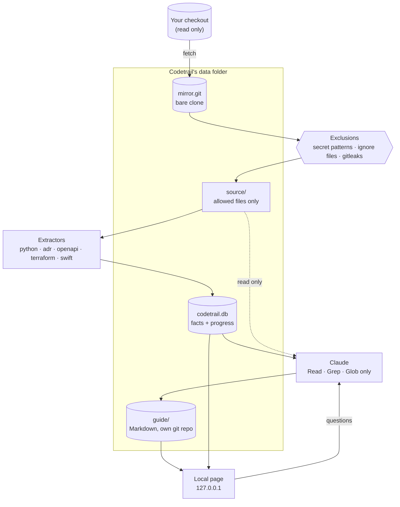
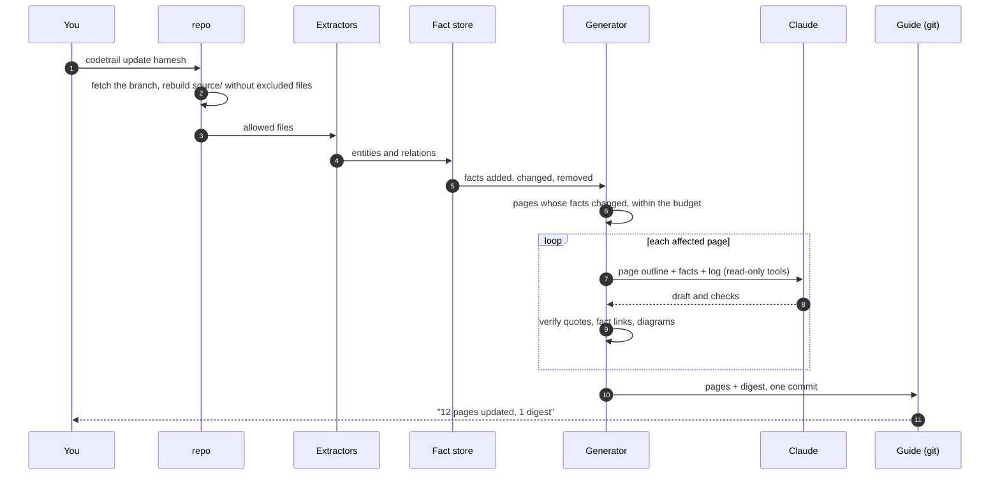
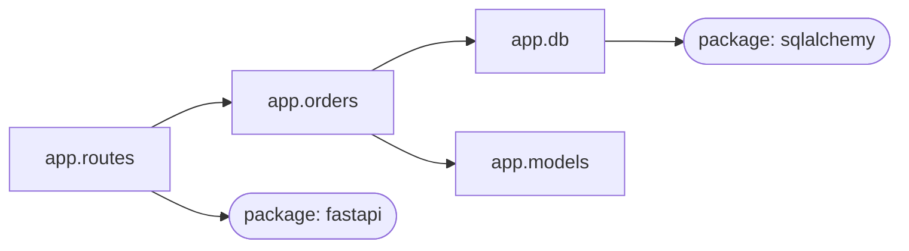
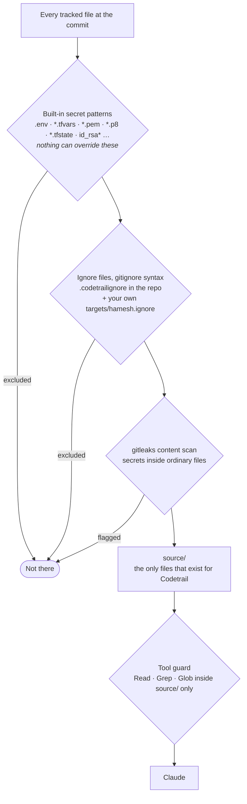
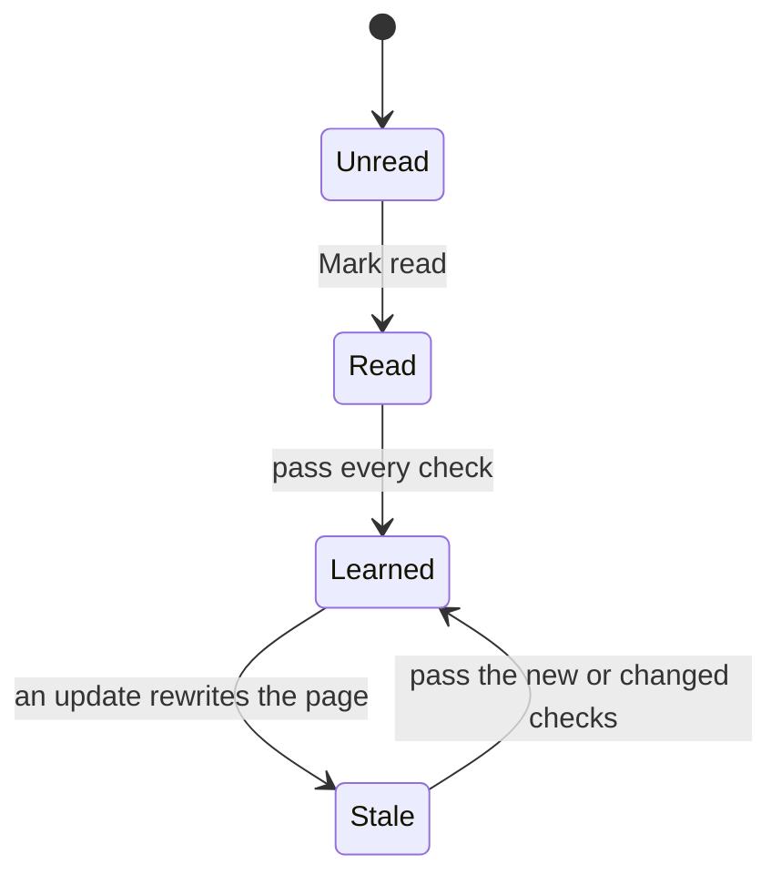
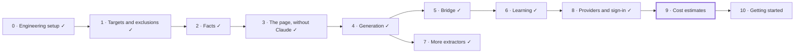

# Codetrail

**Turn a git repository into a local learning guide that keeps up with it.**

Codetrail is for the person responsible for a repository that changes faster than they can follow. It tells you what changed and why it matters, and teaches the architecture, design patterns and tools behind the code: concept pages tied to the real code, guided paths through it, checks on your understanding, and progress that notices when what you learned has gone stale. You read it as a local web page, and you can ask Claude questions from any page.

> [!NOTE]
> **Status: in development.** The [design](docs/design/2026-10-05-codetrail-design.md) and its five [ADRs](docs/adr/README.md) were approved on 5 October 2026, and Phase 0 (the engineering setup) has landed. The roadmap below shows which features run yet; the rest describes the planned tool.

The first repository it teaches is `hamesh-monorepo`; it is built to work on any repository.

## Contents
- [Why Codetrail](#why-codetrail)
- [What you get](#what-you-get)
- [How it works](#how-it-works)
- [Grounded, not guessed](#grounded-not-guessed)
- [Secrets stay out](#secrets-stay-out)
- [Learning, and knowing when it went stale](#learning-and-knowing-when-it-went-stale)
- [Using it](#using-it)
- [Languages](#languages)
- [Roadmap](#roadmap)
- [Developing Codetrail](#developing-codetrail)
- [Documentation](#documentation)

## Why Codetrail

Claude Code already answers questions about a repository well. What it doesn't give you:

| Claude Code alone | Codetrail |
|---|---|
| Each session rediscovers the architecture | A curated guide that persists and grows with the repository |
| Answers what you ask; you have to know what to ask | Tells you what changed since you last looked, and teaches it |
| Diagrams drawn from memory can invent connections | Diagrams drawn only from facts extracted from the code |
| A guess and a decision read the same | Rationale is marked **documented** (quoted and checked) or **inferred** |

Codetrail uses Claude for meaning and code for structure: deterministic extractors parse the repository into facts, and Claude writes explanations from those facts, reading files read-only for the "why".

## What you get

| | Feature | What it does |
|---|---|---|
| 🔔 | **"You're behind" signal** | How many merges landed since the guide was last updated, and which areas they touched. Computed from git alone, so it costs nothing. |
| 📰 | **Digests** | One per update: what changed, why it matters, which pages changed. |
| 🗺️ | **Area and concept pages** | Each component and each pattern, tool or decision, explained against the real code. |
| 📈 | **Grounded diagrams** | Imports, dependencies and infrastructure drawn from extracted facts; every node and edge links to its source. |
| 📜 | **Documented versus inferred** | Rationale quoted from an ADR or commit is verified against the source; everything else is labelled as Claude's reading. |
| 💬 | **Ask from any page** | Questions go to Claude with read-only tools; answers stream into the page in your language. |
| 📌 | **Save to guide** | Answers worth keeping become part of the guide instead of disappearing like chat history. |
| 🧭 | **Guided paths** | Ordered routes through the pages toward a goal, such as "how a request travels through the API". |
| ✅ | **Checks** | Open questions on each page, graded by Claude against a rubric grounded in the code. |
| ♻️ | **Staleness** | When the code behind a page you learned changes, the page says so and shows what changed. |

## How it works

Codetrail never writes to the repository it teaches. It keeps its own mirror, copies out only the files it is allowed to see, extracts facts from them, and has Claude write the guide from the facts.



**An update, step by step.** You run it on demand, from the command line or the page's Update button.



If an update is interrupted, the guide's uncommitted changes are discarded and nothing is half-written. Pages that failed or didn't fit in the budget are picked up by the next update.

## Grounded, not guessed

**Diagrams come from facts.** An extractor turns `services/api/app/orders.py` importing `app.db` into the relation `module:app.orders` → `imports` → `module:app.db`, with the source line. A diagram is a query over those facts, so it can't show a connection the code doesn't have. Above a size limit, it rolls up to directories with counts on the edges, so it stays readable. An example of the shape:



**Rationale says where it comes from.** Claude writes rationale in two kinds of block. Codetrail checks that a documented quote really appears in the cited lines at that commit before the page is saved:

```markdown
> [!documented] docs/adr/0007-rest-api-with-openapi-contract.md#L12-L18
> "Use REST with the OpenAPI document as the contract …"

> [!inferred]
> The handlers stay thin and delegate to services, which suggests …
```

## Secrets stay out

Codetrail runs Claude over repositories that hold secrets, so what it can see is decided before anything reads a file, and enforced twice.



An excluded file is as if it weren't in the repository: it isn't extracted, readable by Claude, shown in the page, or included in diffs, digests or the "you're behind" counts. Symlinks are never copied. Rules use the gitignore syntax you already know:

```gitignore
# ~/.config/codetrail/targets/hamesh.ignore
# A whole directory
docs/design/screens/
# Wildcards, at any depth
**/*.png
apps/ios/**/Generated/
# Re-include a file (never a built-in secret pattern)
!docs/design/README.md
```

**The local page is locked down too.** It listens on `127.0.0.1` only, checks `Host` and `Origin`, signs you in with a one-time code that becomes a strict session cookie, requires a per-session token on every write, renders Markdown with raw HTML disabled, and sends a strict Content Security Policy. Claude has read-only tools and no network access.

## Learning, and knowing when it went stale



When a page you learned is rewritten, it shows a diff of what changed since you learned it, and only the new or changed checks need answering again. If only the files behind it changed, with no change to the facts, the page shows a notice and keeps your progress. "Since you last caught up" lists the digests you haven't read, then the pages that went stale.

## Using it

> [!IMPORTANT]
> Every phase is built. `target add`, `files`, `update` and `serve` work: `update` extracts facts (Python, ADRs, OpenAPI, Terraform, Swift) and writes the guide (outline, guided paths, area and concept pages with checks, digests); the page shows it with diagrams, sources, decisions, the "you're behind" signal, questions to Claude, graded checks and progress. `update --facts-only` skips Claude.

```bash
# Install from this repository (needs uv; gitleaks on your PATH)
uv tool install --editable .

# Register a repository to teach; nothing is written into it
codetrail target add hamesh ~/PersonalProjects/hamesh/hamesh-monorepo --branch develop

# See exactly which files Codetrail can see, before any Claude call
codetrail files hamesh

# Refresh the facts and the guide
codetrail update hamesh

# Open the guide in your browser
codetrail serve hamesh
```

**Where things live:**

```text
~/.config/codetrail/
├── config.toml                  # server, interface language, limits
└── targets/
    ├── hamesh.toml              # repository path, branch, extractors, models, budget
    └── hamesh.ignore            # your exclusions for this target
~/.local/share/codetrail/hamesh/
├── mirror.git/                  # bare clone of your checkout
├── source/                      # allowed files at the current commit
├── guide/                       # the knowledge base, its own git repository
└── codetrail.db                 # facts and your progress
~/.local/state/codetrail/hamesh/
└── codetrail.log                # paths only, never file contents
```

Claude runs through the Claude Agent SDK, or `claude -p` if a sign-in check at the start of Phase 4 calls for it. It is the only service Codetrail calls.

## Languages

The interface is English first and switches language from the page. Each language is one gettext catalog (`src/codetrail/locales/<code>/LC_MESSAGES/codetrail.po`); adding a language means adding a catalog, with no code change. Right-to-left languages such as Arabic are supported. The guide's pages stay in English, because the sources and the quotes are in English; Claude's live answers and check feedback come back in the language you choose.

## Roadmap

Each phase is usable on its own.



| Phase | What you can do at the end | Status |
|---|---|---|
| 0. Engineering setup | `just ci` passes; the agent rules are enforced by hooks and permissions | Done |
| 1. Targets and exclusions | Check on Hamesh that secrets and ignored files are gone, before any Claude call exists | Done |
| 2. Facts | Hamesh's modules, packages and decisions as facts | Done |
| 3. The page, without Claude | A grounded map of Hamesh that says when it's behind, at no Claude cost | Done |
| 4. Generation | The guide: digests, area and concept pages | Done |
| 5. Bridge | Ask from any page and save the answers | Done |
| 6. Learning | Paths, checks, progress and staleness | Done |
| 7. More extractors | OpenAPI, Terraform and Swift packages in the guide | Done |
| 8. Providers and sign-in | Claude Code, Codex or a local model, on your own subscription | Done |
| 9. Cost estimates | An estimate before every paid action | Planned |
| 10. Getting started | A generic README with screenshots, and an install guide | Planned |

## Developing Codetrail

Python with uv, FastAPI, SQLite, tree-sitter and the Claude Agent SDK. The engineering setup is the same as `hamesh-monorepo`'s: mise pins the tools, `just` runs everything, lefthook runs the git hooks, commits follow Conventional Commits with a *Why* in every body, and branches follow git-flow with local-only finishes.

- **Test first.** Every behaviour starts as a failing test, including what must be refused: excluded files, rejected requests, tools Claude may not use.
- **Coding agents never push**, never touch credentials and never write to a target repository. The founder reviews and pushes every change. The full rules are in [AGENTS.md](AGENTS.md).

Once per clone:

```bash
mise trust && mise install
just setup
```

Then `just ci` runs every check CI runs; `just lint`, `just format`, `just typecheck`, `just test`, `just test-quick` (run by the pre-push hook) and `just test-live` (real Claude, local only) run one kind each. Each phase's implementation plan is in [docs/design/plans/](docs/design/plans/).

## Documentation

| Document | What's in it |
|---|---|
| [Design](docs/design/2026-10-05-codetrail-design.md) | The whole system: architecture, exclusions, facts, generation, page and bridge, learning, errors, testing, phases |
| [Brainstorm decisions](docs/design/brainstorm-decisions.md) | The problem, every early decision and why |
| [Architecture decision records](docs/adr/README.md) | Decisions that are hard to reverse, starting with 0001 to 0005 |
| [AGENTS.md](AGENTS.md) | Rules and workflow for coding agents |
