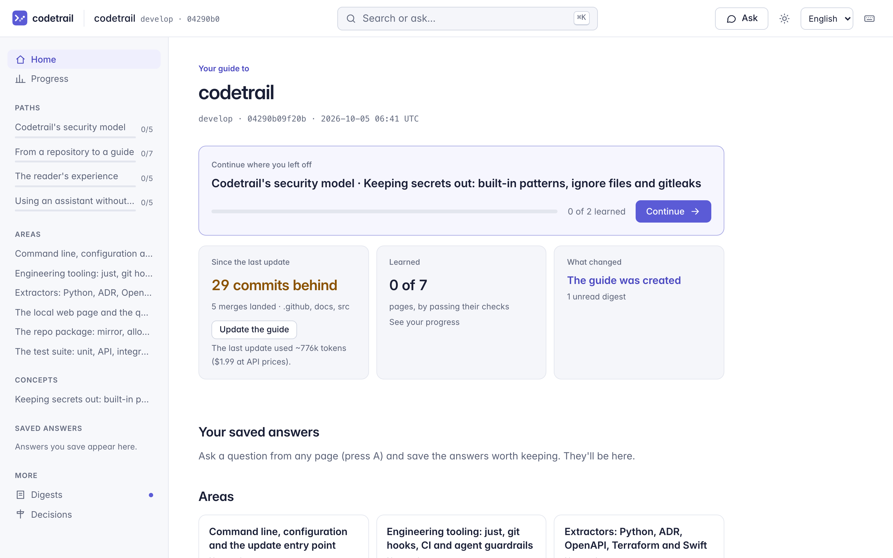
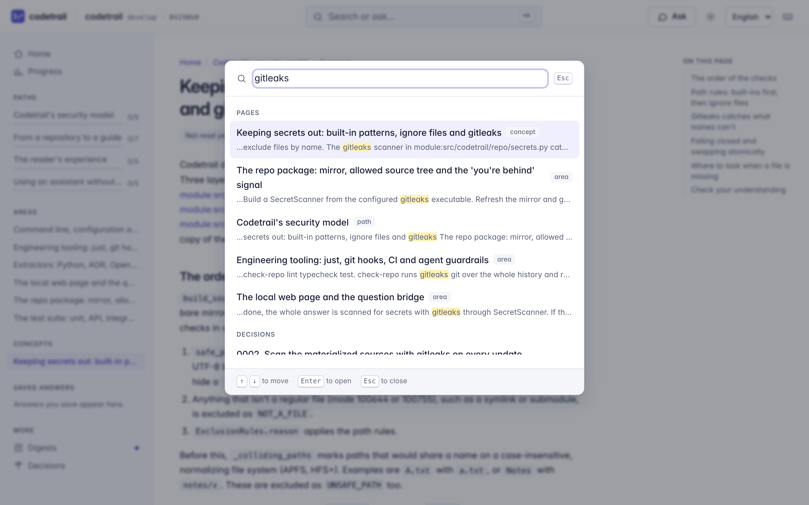

# Getting started

This guide takes you from nothing to a running Codetrail guide for one of your repositories: install it, connect an assistant, add the repository, build the guide, and open it in your browser. It takes about ten minutes, plus the time the first update runs.

Codetrail only reads your repository. It never writes to it, and everything it makes lives in its own folders.

## 1. What you need

- **macOS or Linux**, with **git**.
- **[uv](https://docs.astral.sh/uv/)**, which installs Codetrail and the Python it needs.
- **[gitleaks](https://github.com/gitleaks/gitleaks)** on your `PATH` (`brew install gitleaks`, a release binary, or `mise use -g gitleaks`; a mise shim works where mise sets a version), or its absolute path in `[tools] gitleaks` in `~/.config/codetrail/config.toml`. Codetrail refuses to read a repository without it, because it scans every file for secrets first.
- **One assistant**, with a subscription you already have. You can mix them later.

| Assistant | You need | Set it up |
|---|---|---|
| **Claude Code** (the default) | A Claude Pro or Max subscription | [Install Claude Code](https://code.claude.com/docs/en/setup), run `claude` once, and sign in with `/login` using your Claude account |
| **Codex** | A ChatGPT Plus or Pro subscription | `npm install -g @openai/codex`, then `codex login` and choose **Sign in with ChatGPT** |
| **A local model** | Nothing but your machine | [Ollama](https://ollama.com): `ollama pull qwen3:14b`, then `ollama serve`; or [LM Studio](https://lmstudio.ai)'s local server |

Codetrail runs your own signed-in `claude` or `codex` program and never sees your password, token or key. By default it removes every API key from the environment those programs get, so the work counts against your subscription and never bills an API account by surprise (section 7 covers choosing a key on purpose).

## 2. Install

```bash
git clone https://github.com/mohamed-abdelsattar92/codetrail.git
```

```bash
cd codetrail && uv tool install .
```

```bash
codetrail --version
```

To install a release without cloning, run `uv tool install git+https://github.com/mohamed-abdelsattar92/codetrail@v1.1.1` instead. `uv tool install` puts `codetrail` on your `PATH`. After you pull a newer version, run `uv tool install --reinstall .` again. To try it without installing anything, run each command below as `uvx --from <path to the clone> codetrail …` instead.

## 3. Check your assistant

```bash
codetrail providers
```

You'll see each provider, whether it's installed and signed in, and how:

```
claude_code  ready      Claude subscription (max) · /Users/you/.local/bin/claude
codex        not ready
             Install Codex (`npm install -g @openai/codex`), then run `codex login` and choose Sign in with ChatGPT.
local        not ready  http://127.0.0.1:11434/v1
             Start Ollama (`ollama serve`) or LM Studio's server, or set [providers.local] base_url (http://127.0.0.1:11434/v1).
```

Only the providers you use need to be ready. Out of the box that's Claude Code.

## 4. Add a repository

```bash
codetrail target add shop ~/code/shop --branch main
```

`shop` is the short name you'll use from now on. Codetrail writes the target's settings to `~/.config/codetrail/targets/shop.toml`. Nothing is written into the repository.

## 5. See exactly what Codetrail can read

```bash
codetrail files shop
```

This lists every file Codetrail can see, then every file it hides and why. Codetrail reads only what is committed on the branch, so files git ignores and never committed don't exist for it. Some files are always hidden, whatever any setting says: `.env` files, Terraform variables, private keys and credential files, anything gitleaks flags, and every symlink. A file that was committed anyway, though `.gitignore` lists it, is visible unless one of those catches it, so list it in your ignore rules too. To hide more, add gitignore-style rules to `~/.config/codetrail/targets/shop.ignore`, or commit a `.codetrailignore` to the repository:

```gitignore
# never read the fixtures or anything under legacy/
tests/fixtures/
legacy/**
```

Run `codetrail files shop` again to check the result before any assistant reads a thing.

## 6. Build the guide

The facts (modules, packages, routes, infrastructure, decisions) cost nothing to extract:

```bash
codetrail update shop --facts-only
```

The guide itself is written by your assistant. Before any paid work, `codetrail update` refreshes the facts, works out the calls it would make, and asks:

```bash
codetrail update shop
```

```
This update will call:
  plan    claude_code · claude-opus-5-5: 1 call(s), ~68k tokens each (a starting guess), ~$0.40 each
  write   claude_code · claude-sonnet-5-5: 8 to 16 call(s), ~126k tokens each (a starting guess), ~$0.30 each
  digest  claude_code · claude-sonnet-5-5: 1 call(s), ~43k tokens each (a starting guess), ~$0.11 each
Expected: ~1.1M tokens (at most ~2.1M), ~$2.91 (at most $5.31) at API prices. The update stops at its budget of $10.00 or 5.0M tokens.
claude_code: Claude subscription (max), so no charge; the work counts against your plan's usage limits.
Continue? [y/N]
```

- **Dollars** are what the same work would cost at API prices. On a subscription you pay nothing extra; the work uses your plan's limits, and the estimate shows how much of each limit you've used once Claude Code has reported it.
- **A starting guess** marks an estimate made before Codetrail has a history of its own calls. After a few updates, estimates use the median of your own recent calls.
- **"At most"** counts every page being written twice (a failed check gets one retry). The update also stops at its budgets, whichever comes first.
- **A smaller first update:** the first update writes up to 20 pages. To keep it smaller, add this to `~/.config/codetrail/targets/shop.toml`:

  ```toml
  [generation]
  max_pages_per_update = 8
  ```

  The pages left out are written by later updates.

In a script, with no terminal to ask in, `codetrail update` prints the estimate, spends nothing and exits with code 2. Add `--yes` to go ahead without the question.

## 7. Open the page

```bash
codetrail serve shop
```

`serve` prints a one-time sign-in link and opens it in your browser. The page runs on `127.0.0.1` only, and the session ends when you stop `serve` (Ctrl-C). An update you started from the page stops with it, and the guide stays as it was before that update.



- **The home page** picks up where you left off: the next page of your current path, how far the guide is behind the branch (with what the last update used), how much you've learned, what changed, and your saved answers.
- **The sidebar** lists the guided paths with your progress, the areas and concepts, your saved answers, the digests and the decisions.
- **System** (in the sidebar, or **G** then **Y**) draws how the repository's parts connect: services, apps, libraries, contracts, infrastructure and where each runs. Solid arrows come from a file you can open; dashed ones were matched by name. Each area page shows the same diagram focused on its folder.
- **Documentation** (in the sidebar, or **G** then **O**) shows how well the repository explains itself: how much of the guide's rationale is documented and from where, which commits explain why, which ADRs need attention, and which dependencies no document mentions, each with the items behind it and a trend across updates. It's free; `codetrail metrics shop` prints the same numbers. What counts as a document, and as a commit that explains why, is set per repository in `[metrics]` in its settings file.
- **Repository** (in the sidebar, or **G** then **T**) shows what the repository is: when it started, its commits and activity month by month, its releases (the tags on the branch, with their notes), its lines of code by language and the share in tests, its facts by kind with the dependencies that arrived and left, and where change happens: the most changed files, folders and guide areas (beside how much of each area's rationale is documented), quiet code and commit size. It's free; `codetrail stats shop` prints the summary. What counts as a test, and how commit subjects are typed, is set per repository in `[metrics]` too (`test_globs`, `commit_type_pattern`).
- **Area and concept pages** explain one part of the repository, with a diagram drawn from the facts, quotes linked to their source lines, an "On this page" outline, and checks on your understanding. **Previous** and **Next** follow the path you came from.
- **Check my answer** grades your answer to a check. Each button shows its estimate, and afterwards what it used.

### Search, ask and save

- Press **⌘K** (Ctrl+K on Linux) or **/** anywhere to search the guide: pages, saved answers, decisions and facts. Search runs on your machine and costs nothing.
- Press **A**, or choose **Ask about** in the search box, to open the Ask panel beside the page you're reading. Your question goes with the page as context, and **Send** shows the estimate before anything is spent.
- The panel keeps this session's answers while you move between pages. **Save to guide** keeps an answer for good: it appears under **Saved answers** in the sidebar, on the Saved answers page, and in search.



### Shortcuts

Press **?** on any page to see them all.

| Keys | Does |
|---|---|
| **⌘K** or **/** | Search, or ask a question |
| **A** | Ask about this page |
| **G** then **H**, **P**, **Y**, **S**, **D**, **R**, **O**, **T** | Go home, to your progress, your system, saved answers, digests, decisions, documentation or the repository |
| **[** and **]** | Previous and next page in the path |
| **M** | Mark this page read, or unread |
| **U** | Update the guide (shows the estimate first) |
| **Esc** | Close the palette, the panel or a dialog |

No shortcut spends anything: questions are sent by their **Send** button, and an update starts only when you choose **Go ahead**.

### Updating from the page

**Update the guide** (or **U**) refreshes the facts, then shows the update's estimate in a dialog. Nothing is spent until you choose **Go ahead**.

The theme follows your system; the sun button in the header switches between system, light and dark.

## 8. Choose assistants and models

Each kind of call (`plan`, `write`, `digest`, `answer`, `grade`) names its provider and model in the target's settings, as `provider:model`:

```toml
[models]
plan = "claude_code:claude-opus-5-5"
write = "claude_code:claude-sonnet-5-5"
digest = "claude_code:claude-sonnet-5-5"
answer = "local:qwen3:14b"          # questions answered by a model on your machine, free
grade = "claude_code:claude-sonnet-5-5"
```

To use Codex for a target, opt in first. Codex's sandbox stops writes but not reads, and its tools are shell commands. So Codex can read anything you can, including the files Codetrail hides (through Codetrail's own data folder) and your own keys, can run the repository's code inside its sandbox, and sends whatever it reads to OpenAI before Codetrail's scan sees it. Use it only for repositories where that's acceptable:

```toml
[assistant]
allow_codex = true

[models]
write = "codex:gpt-5.5-codex"
```

Settings for all targets go in `~/.config/codetrail/config.toml`:

```toml
[providers.claude_code]
auth = "subscription"      # or "api_key": then ANTHROPIC_API_KEY is passed to claude, and you're billed by the API

[providers.local]
base_url = "http://127.0.0.1:1234/v1"   # LM Studio instead of Ollama; only addresses on this machine are allowed

[prices."gpt-5.5-codex"]               # USD per million tokens, for estimates of models Codetrail has no price for;
input = 1.25                           # placeholder values: copy the current ones from
output = 10.0                          # https://developers.openai.com/api/docs/pricing
```

The full list of settings is in [the design, section 9](design/2026-10-05-codetrail-design.md#9-configuration), and providers are covered in [section 15](design/2026-10-05-codetrail-design.md#15-assistant-providers-sign-in-and-cost-estimates).

## 9. Keep up

Run `codetrail update shop` whenever the repository has moved on; the page's home says how far behind the guide is. Each update rewrites only the pages whose facts changed, learned pages first, and writes a digest of what changed and why.

## Where things live

| Path | Holds |
|---|---|
| `~/.config/codetrail/` | Settings: `config.toml`, and `targets/<name>.toml` and `.ignore` |
| `~/.local/share/codetrail/<name>/` | A private copy of the repository's allowed files, the facts, and the guide (its own git repository) |
| `~/.local/state/codetrail/<name>/` | Logs |

The `XDG_CONFIG_HOME`, `XDG_DATA_HOME` and `XDG_STATE_HOME` variables move these folders.

To remove one repository, run `codetrail target remove shop`; it refuses while `codetrail serve` or an update is using the target, so stop those first. It lists what it will delete (the target's settings, its ignore file, and its data and state folders), asks first, and never touches the repository itself. `--yes` skips the question.

To remove Codetrail, run `uv tool uninstall codetrail` and delete those folders.

## Troubleshooting

| You see | Do this |
|---|---|
| No **System** link, or no facts for TypeScript, JavaScript or Astro code | A target's settings may list its extractors. Add `"typescript"` and `"github_actions"` to `extractors` in `~/.config/codetrail/targets/<name>.toml`, then run `codetrail update <name> --facts-only` (free). A repository with no projects, contracts or infrastructure has no parts to draw |
| `gitleaks wasn't found` | Install gitleaks and make sure it's on your `PATH`, or set `[tools] gitleaks` in `config.toml` |
| `… is a mise shim, and mise couldn't say which gitleaks it runs here` | The `gitleaks` on your `PATH` is a mise shim, and no mise configuration in the folder you ran Codetrail from (or a parent) sets a gitleaks version. Run Codetrail from such a folder, set a global version with `mise use -g gitleaks`, or set `[tools] gitleaks` in `config.toml` to the binary's absolute path (`mise which gitleaks` prints it) |
| `mise named … as gitleaks here, which isn't one of mise's own installs` | A mise configuration in the folder you ran Codetrail from names a gitleaks outside mise's installs (a `path:` version, perhaps from a repository you're reading), and Codetrail won't run it. Run Codetrail from another folder, or set `[tools] gitleaks` to a gitleaks you trust |
| `gitleaks didn't finish within … seconds ([tools] gitleaks_timeout_seconds)` | gitleaks was stopped before it finished scanning, and the update failed. For a large repository, raise `gitleaks_timeout_seconds` under `[tools]` in `config.toml` |
| `… is a mise shim, and mise didn't say which gitleaks it runs here within … seconds` | mise didn't answer in time, often because a mise configuration in the folder you ran Codetrail from runs a slow command. Check that folder's mise configuration, run Codetrail from another folder, or set `[tools] gitleaks` in `config.toml` to the binary's absolute path |
| `gitleaks failed (exit code …)` | The message ends with what gitleaks printed. To run a different gitleaks, set `[tools] gitleaks` in `config.toml` to its absolute path |
| `claude_code isn't ready. Run claude and sign in with /login` | Run `claude`, then `/login` with your Claude account |
| `Claude Code isn't signed in with a Claude subscription` | You signed in with an API (Console) account: `/login` again with your Claude account, or set `auth = "api_key"` on purpose |
| `local isn't ready` | Start `ollama serve` (or LM Studio's server) and pull a model |
| `update` exits with code 2 | There was no terminal to ask in; read the estimate it printed and add `--yes` |
| `Codex can read outside the repository's allowed files` | Add `[assistant] allow_codex = true` to the target, knowing Codex can read outside the allowed files |
